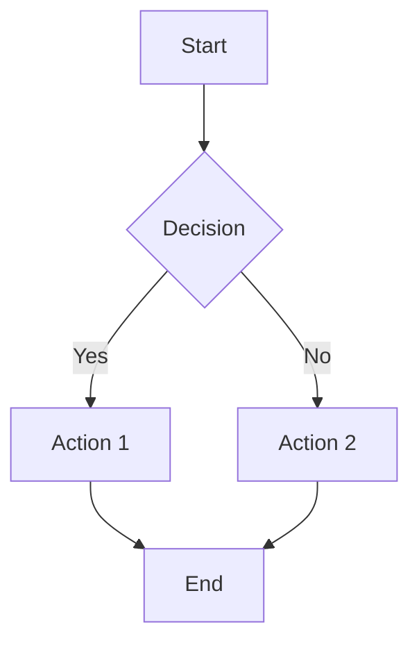
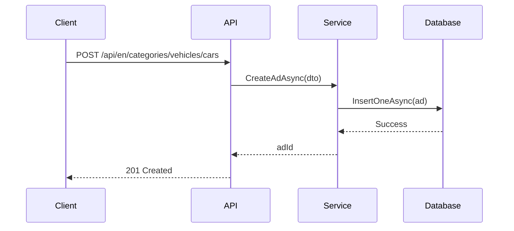
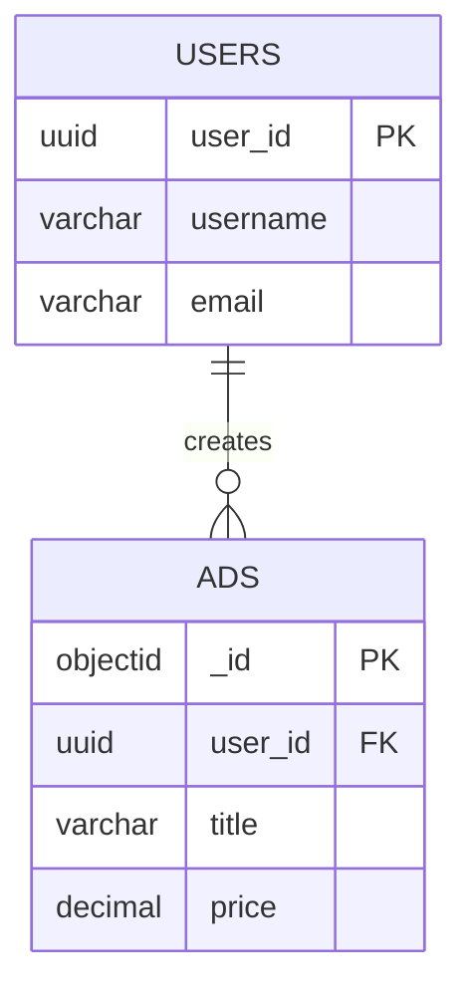
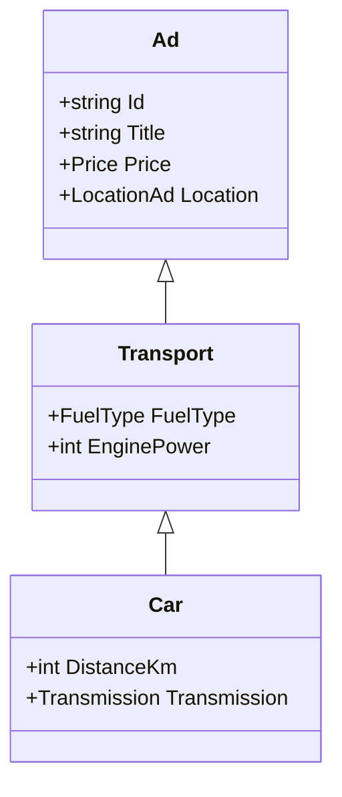

# Diagrams Guide

This directory contains all diagrams and visual aids for the diploma documentation.

## Directory Structure

```
diagrams/
├── mermaid/           # Mermaid diagram source files (.mmd)
├── images/            # Exported diagram images (PNG/SVG)
└── README.md          # This file
```

## Diagram Types

### 1. Entity Relationship Diagrams (ERD)
- **Tool**: Mermaid ER diagram syntax
- **Purpose**: Show database table relationships
- **Location**: Chapter 3 - Database Design

### 2. Class Diagrams
- **Tool**: Mermaid class diagram syntax
- **Purpose**: Show object-oriented structure
- **Location**: Chapter 4 - Application Architecture

### 3. Sequence Diagrams
- **Tool**: Mermaid sequence diagram syntax
- **Purpose**: Show interaction between components
- **Location**: Chapter 7 - Activity Diagrams

### 4. Activity Diagrams
- **Tool**: Mermaid flowchart syntax
- **Purpose**: Show process workflows
- **Location**: Chapter 7 - Activity Diagrams

### 5. Architecture Diagrams
- **Tool**: Mermaid flowchart or custom
- **Purpose**: Show system layers and dependencies
- **Location**: Chapter 4 - Application Architecture

## Creating Diagrams with Mermaid

### Installation
Mermaid diagrams can be rendered in:
- **VS Code**: Install "Markdown Preview Mermaid Support" extension
- **Online**: https://mermaid.live/
- **CLI**: Install mermaid-cli (`npm install -g @mermaid-js/mermaid-cli`)

### Basic Syntax

#### Flowchart


#### Sequence Diagram


#### Entity Relationship Diagram


#### Class Diagram


## Exporting Diagrams

### Using Mermaid CLI
```bash
# Export to PNG
mmdc -i diagram.mmd -o diagram.png

# Export to SVG
mmdc -i diagram.mmd -o diagram.svg

# Export with custom theme
mmdc -i diagram.mmd -o diagram.png -t forest
```

### Using Online Editor
1. Go to https://mermaid.live/
2. Paste your Mermaid code
3. Click "Download PNG" or "Download SVG"

### Using VS Code
1. Install "Markdown Preview Mermaid Support" extension
2. Open Markdown file with Mermaid diagram
3. Right-click on preview → "Export to PNG/SVG"

## Diagram Naming Convention

Use descriptive names with chapter numbers:
- `ch3-postgresql-er-diagram.mmd`
- `ch3-mongodb-document-structure.mmd`
- `ch4-clean-architecture-layers.mmd`
- `ch4-dependency-flow.mmd`
- `ch7-create-ad-workflow.mmd`
- `ch7-search-ads-sequence.mmd`

## Diagram Style Guidelines

### Colors
- Use consistent color scheme across all diagrams
- Primary: Blue (#2563eb)
- Secondary: Green (#16a34a)
- Warning: Yellow (#eab308)
- Error: Red (#dc2626)

### Fonts
- Use clear, readable fonts
- Minimum font size: 12pt
- Labels should be concise

### Layout
- Left-to-right or top-to-bottom flow
- Consistent spacing between elements
- Clear connection lines
- Avoid crossing lines when possible

### Labels
- Use clear, descriptive labels
- Keep labels short (max 3-4 words)
- Use consistent terminology

## Required Diagrams List

### Chapter 1: Introduction
- [ ] Technology Stack Diagram

### Chapter 2: Requirements
- [ ] Use Case Diagram
- [ ] Actor-System Interaction Diagram

### Chapter 3: Database Design
- [ ] PostgreSQL ER Diagram (complete schema)
- [ ] MongoDB Document Structure Diagram
- [ ] LTREE Hierarchy Example
- [ ] Discriminator Pattern Illustration

### Chapter 4: Architecture
- [ ] Clean Architecture Layers Diagram
- [ ] Dependency Flow Diagram
- [ ] Domain Layer Class Diagram
- [ ] DTO Hierarchy Diagram

### Chapter 5: Key Features
- [ ] Multilingual Routing Flow
- [ ] Dynamic URL Parsing Flowchart
- [ ] Image Upload Process

### Chapter 6: API Documentation
- [ ] API Endpoint Overview Diagram

### Chapter 7: Activity Diagrams
- [ ] Create Ad Workflow
- [ ] Search Ads Workflow
- [ ] Update Ad Workflow
- [ ] Category Navigation Workflow
- [ ] Create Ad Sequence Diagram
- [ ] Search Ads Sequence Diagram

## Tips for Effective Diagrams

1. **Keep it Simple**: Don't overcrowd diagrams
2. **Be Consistent**: Use same shapes/colors for same concepts
3. **Add Context**: Include brief descriptions
4. **Test Readability**: Ensure diagrams are clear when printed
5. **Version Control**: Keep source files (.mmd) in version control
6. **Export Multiple Formats**: PNG for documents, SVG for web

## Resources

- Mermaid Documentation: https://mermaid.js.org/
- Mermaid Live Editor: https://mermaid.live/
- Draw.io: https://app.diagrams.net/
- PlantUML: https://plantuml.com/
